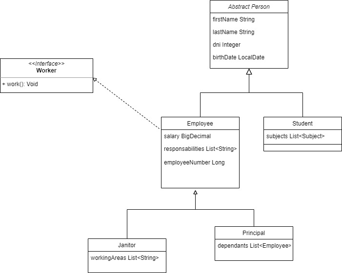
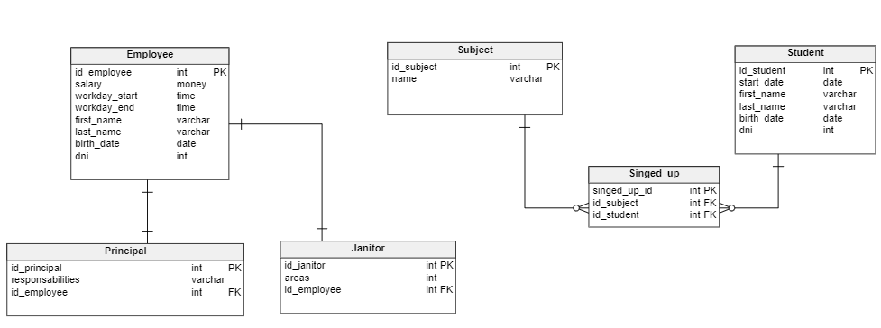
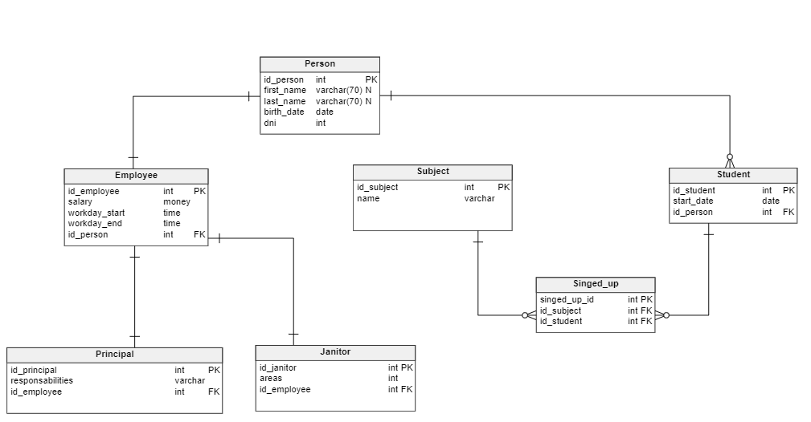

# School Challenge


## A)
Considering	the	structure	of	a	school,	create	the	diagram	that	describes	the
domain	model	and	relationship	between	entities.	Some	of	the	possible	entities
may	be	Principal,	Employee,	Student	and	Janitor.	Try	to	apply	the	concepts	of
Hierarchy,	Abstract	Class	and	Interface




## B)
Implement	a Java method	that	returns	all	the	students	in	the	school	grouped
by	the	first	letter	of	their	last	name.

```java
@Override
    public Map<Character, List<Student>> getStudentsGroupByFirstLetterOfLastName() {
        Map<Character, List<Student>> studentsMap = new HashMap<>();

        students.forEach(student -> {
            char letter = student.getLastName().charAt(0);
            letter = Character.toUpperCase(letter);
            List<Student> studentsFromMap = studentsMap.get(letter);
            if(Objects.nonNull(studentsFromMap)) {
                studentsFromMap.add(student);
            } else {
                List<Student> list = new ArrayList<>();
                list.add(student);
                studentsMap.put(letter, list);
            }
        });
        return studentsMap;
    }
```


## C)
Implement	a	java	method	that	returns	all	students	taking	a	specific	subject.
Please	consider	that	the	students	cannot	be	repeated,	this	needs	to	be	verified.
```java
public class Subject {
    private String name;
    private Employee teacher;
    private Set<Student> students;

    public Subject(String name, Employee teacher, Set<Student> students) {
        this.name = name;
        this.teacher = teacher;
        this.students = students;
    }

    public List<Student> getStudents() {
        return new ArrayList<>(students);
    }
}
```
## D)
Create at	least	two different database	table	structure diagrams	to	describe the
possible ways	 that	 the	domain	could	be	 translated	 to	 the database. Explain
pros	and	cons	of	each	structure.

```java
pros:
- Less joins for queries.
cons:
- Less scalability, we need to add person atributes in all entities.
```

```java
pro:
- More scalability and less repeated atributes.
cons:
- More joins in queries for getting data.
```
## E)
Having	the	following	query:

SELECT * FROM janitor	j
INNER	JOIN employee	e
ON e.id	=	j.id
INNER	JOIN person	p
ON	p.id	= j.id
WHERE	j.workingArea = ‘Hallway’;

Our	query	is	taking	too	long	to	respond.	What	changes	would	you	do	to	the	query
and/or	the	database	to	make	it	go	faster if	we	only	need	the	first	and	last	name	of
the	janitor
```java
SELECT firstName, lastName 
FROM janitor j 
INNNER JOIN person p ON p.id=j.id 
WHERE j.workingArea = 'Hallway'
```
## F)
Consider	that	we	have	a	query	that	joins	many	tables	and	takes	too	long	to
return	the	values.	We	know	as	a	fact	that	the	tables	involved	do	not	update
too	often,	but	we	still	use	this	query	many	times	in	a	day	(consider	it	a	report).
What	would	you	do	to	be	able	to	get	these results	faster?

```java
I would create a view with the data we need and for update that view i would create a store
procedure with a trigger for manntein the view updated after insert.
```
## G)
Using	the	model	create	a	query	that	returns	all	the	students	with	age	between
19	and	21. Take	into	account	that	the	age	is	not	a	column	on	the	table,	we	have
a	field	for	birth	date. How	would	you	optimize	this	query?

```java
SELECT * 
FROM Persons 
WHERE year(birthdate) 
between YEAR(current_timestamp)-21 
and
YEAR(current_timestamp)-19 
I can optimize this query saving the age in a field in the database.
```
## H)
We	 need	 to	 build	 a	 new	 application	 and	 we	 want	 to	 be	 able	 to	 have	 the
business	logic	on	the	database	engine	instead	of	having	it	in	our	Java	code.	Can
you	 suggest	 a	 way	 of	 doing	 this?	 As	 an	 example,	 how	 would	 you	 persist	 a
student?	What	are	the	pros	and	cons	of	this?

```java
We can have all buisness logic in the database in store procedures and triggers for manntein the intergrity of the database.
We can persist the student with an insert query with a trigger after insert for manntein the database intergrity. 
An example of insert could be:
INSERT INTO student (first_name, last_name, birth_date) VALUES("Name", "LastName", "1990-02-07");
In the pros we have all the logic in the same place with the data. In the cons we have less scalability, more proccesing in database engine, less performance.
```
